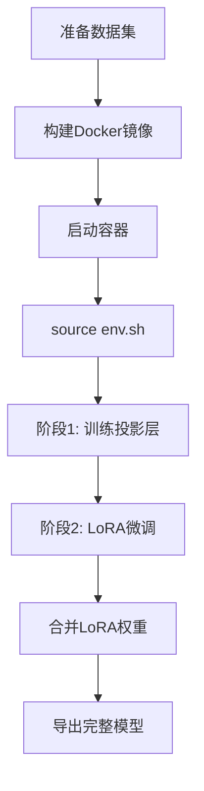

# Gaudi2 8卡多模态大模型训练底座工程

## 📦 项目结构

```
gaudi-training-base/
│
├── 🐳 Docker环境
│   ├── Dockerfile                          # 基于Habana 1.24.1镜像
│   └── env.sh                              # 训练环境变量（PT_HPU_LAZY_MODE等）
│
├── ⚙️ 训练配置
│   └── ds_config_gaudi_z2.json             # DeepSpeed ZeRO Stage2配置
│
├── 🎯 训练脚本
│   ├── train_qwen_multimodal.py            # 两阶段训练主脚本
│   └── merge_lora.py                       # LoRA权重合并工具
│
├── 📊 数据集
│   └── data/
│       ├── train_cad.jsonl                 # CAD图纸标注样例（think范式）
│       └── images/                         # 图像文件夹（需自行准备）
│
├── 📖 文档
│   ├── README.md                           # 完整使用文档
│   └── PROJECT_STRUCTURE.md                # 本文件
│
└── 🚫 .gitignore                           # 排除权重/数据/日志
```

## 🎯 核心文件说明

### 1. 训练脚本 `train_qwen_multimodal.py`

**功能**:
- ✅ 阶段1：冻结LLM+视觉编码器，训练投影层
- ✅ 阶段2：冻结视觉编码器，LoRA微调LLM
- ✅ 基座无关设计，支持替换其他多模态模型

**关键参数**:
```bash
--stage 1/2                    # 训练阶段
--model_name_or_path          # 基座模型路径
--data_path                   # JSONL数据路径
--image_folder                # 图像目录
--lora_r 64                   # LoRA秩
--lora_target_modules         # LoRA目标层
```

### 2. 环境配置 `env.sh`

**关键环境变量**:
```bash
PT_HPU_LAZY_MODE=1                      # 必须：启用Lazy图编译
PT_HPU_ENABLE_LAZY_COLLECTIVES=true     # 计算通信重叠
HABANA_VISIBLE_DEVICES=all              # 8卡全部可见
DS_ACCELERATOR=hpu                      # DeepSpeed适配Gaudi
```

### 3. DeepSpeed配置 `ds_config_gaudi_z2.json`

**ZeRO-2优化**:
- `stage: 2` - 优化器状态分片
- `overlap_comm: true` - 通信计算重叠
- `fp16.enabled: true` - 混合精度训练
- 自动推断 batch size 和梯度累积

### 4. 数据格式 `data/train_cad.jsonl`

**Qwen多模态对话格式**:
```json
{
  "messages": [
    {
      "role": "user",
      "content": [
        {"type": "image", "image": "xxx.jpg"},
        {"type": "text", "text": "问题"}
      ]
    },
    {
      "role": "assistant",
      "content": "<think>推理过程</think>\n识别结果"
    }
  ]
}
```

**关键约束**:
- assistant必须输出 `<think>...</think>` 思维链
- 图像路径相对于 `--image_folder`

### 5. 权重合并 `merge_lora.py`

**用途**: 训练完成后，将LoRA适配器合并回基座

```bash
python merge_lora.py \
  --base_model 原始基座路径 \
  --lora_adapter 训练输出目录 \
  --output 合并后保存路径
```

## 🔧 工作流程



## 📝 快速启动清单

- [ ] 准备数据集 `data/train_cad.jsonl` + `data/images/`
- [ ] 构建镜像 `docker build -t gaudi-multimodal-train:1.24.1 .`
- [ ] 启动容器并挂载数据/模型/输出目录
- [ ] 加载环境 `source env.sh`
- [ ] 阶段1训练（3-5 epochs）
- [ ] 阶段2训练（5-10 epochs）
- [ ] 合并权重 `python merge_lora.py`
- [ ] 验证输出是否包含think标签

## 🎯 设计理念

1. **基座无关**: 以Qwen为示例，预留替换入口
2. **最小可用**: 仅保留训练必需代码，无推理服务
3. **硬件原生**: 深度适配Gaudi2 Lazy模式
4. **范式固化**: 强制think输出，训练可解释AI

## ⚠️ 注意事项

- 工程**仅用于训练**，不引入vLLM推理框架
- 必须使用Lazy模式（Eager多卡性能低）
- 图像预处理在CPU dataloader完成
- 首次训练会编译图（30s-2min），后续复用缓存

## 📚 参考资料

- [Habana文档](https://docs.habana.ai/)
- [Qwen2-VL](https://github.com/QwenLM/Qwen2-VL)
- [optimum-habana](https://github.com/huggingface/optimum-habana)
- [DeepSpeed](https://github.com/microsoft/DeepSpeed)
