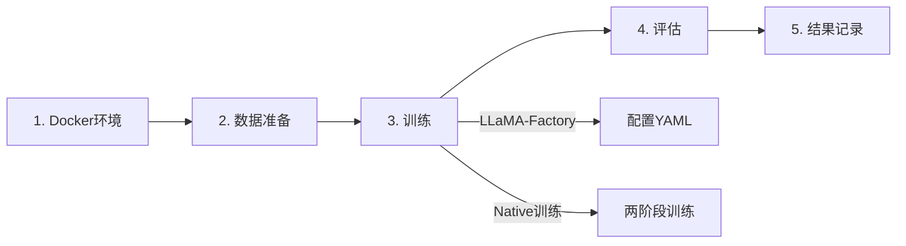

# Gaudi2 多模态训练环境

Intel Gaudi2 8卡 + Qwen3.5 多模态模型训练底座，基于 LLaMA-Factory 和原生训练双方案。

---

## 🎯 项目特点

- **双训练方案**: LLaMA-Factory (快速验证) + Native (深度定制)
- **多模态支持**: 图像+文本输入，think思维链输出
- **Gaudi2优化**: Lazy模式、DeepSpeed ZeRO-2、8卡分布式
- **基座无关**: 支持 Qwen、LLaVA、InternVL 等多模态模型

---

## 📦 项目结构

```
gaudi-training-base/
├── docker/              # Docker 环境构建
│   ├── Dockerfile       # Habana 1.24.1 基础镜像
│   ├── deploy.sh        # 一键部署脚本
│   └── env.sh          # 训练环境变量
│
├── training/           # 训练脚本
│   ├── llamafactory/   # LLaMA-Factory 方案（推荐入门）
│   └── native/         # 原生训练方案（深度定制）
│
├── evaluation/         # 模型评估
│   └── README.md       # 评估指南
│
├── results/            # 训练结果记录
│   └── README.md       # 结果管理
│
├── tools/              # 辅助工具
│   ├── merge_lora.py   # LoRA权重合并
│   ├── inference_demo.py
│   └── evaluate_identification.py
│
├── data/               # 训练数据
│   ├── examples/       # 样例数据
│   └── images/         # 图像文件夹
│
├── configs/            # 配置文件
│   └── deepspeed_z2.json
│
└── docs/               # 完整文档
    ├── README.md       # 详细使用文档
    ├── QUICKSTART.md   # 快速开始
    └── PROJECT_STRUCTURE.md
```

---

## 🚀 快速开始

### 方案一：使用 LLaMA-Factory（推荐入门）

适合快速验证和标准训练场景。

#### 1. 构建 Docker 环境

```bash
cd docker
bash deploy.sh
```

这会自动：
- 构建镜像 `gaudi-train-qwen35:v2`
- 启动容器 `gaudi-mutimodel-training`
- 挂载模型和数据目录

#### 2. 进入容器并验证环境

```bash
docker exec -it gaudi-mutimodel-training bash
bash verify_env.sh
```

验证脚本会检查：
- ✅ HPU 设备（8 个 Gaudi2）
- ✅ 模型路径
- ✅ LLaMA-Factory 安装
- ✅ 运行一次完整训练测试

#### 3. 查看训练结果

```bash
# 查看训练输出
ls -lh /workspace/LLaMA-Factory/saves/qwen3.5-0.8b-v2/

# 查看训练日志
cat /workspace/LLaMA-Factory/saves/qwen3.5-0.8b-v2/trainer_log.jsonl
```

**详细文档**: [training/llamafactory/README.md](training/llamafactory/README.md)

---

### 方案二：使用原生训练（深度定制）

适合需要完全控制训练流程的高级用户。

#### 1. 环境准备

```bash
source docker/env.sh
bash scripts/verify_env.sh
```

#### 2. 两阶段训练

```bash
# 阶段1：投影层预训练
bash training/native/train_stage1.sh

# 阶段2：LoRA 指令微调
bash training/native/train_stage2.sh
```

#### 3. 权重合并

```bash
python tools/merge_lora.py \
  --base_model /models/Qwen/Qwen3.5-7B \
  --lora_adapter outputs/stage2_lora \
  --output outputs/merged_model
```

**详细文档**: [docs/README.md](docs/README.md)

---

## 📊 训练流程



### 1. Docker 环境搭建

```bash
cd docker
bash deploy.sh
```

**输出**: 
- Docker 镜像: `gaudi-train-qwen35:v2`
- 运行容器: `gaudi-mutimodel-training`

**相关文档**: [docker/README.md](docker/) （如果存在）

---

### 2. 训练数据准备

数据格式示例（Qwen 多模态）:

```json
{
  "messages": [
    {
      "role": "user",
      "content": [
        {"type": "image", "image": "drawing_001.jpg"},
        {"type": "text", "text": "识别这张CAD图纸"}
      ]
    },
    {
      "role": "assistant",
      "content": "<think>观察图纸布局...</think>\n这是一个法兰盘零件..."
    }
  ]
}
```

将数据放置在 `data/` 目录。

**相关文档**: [data/README.md](data/README.md)

---

### 3. 模型训练

选择训练方案：

**LLaMA-Factory 方案**:
```bash
cd training/llamafactory
bash train.sh
```

**Native 方案**:
```bash
bash training/native/train_stage1.sh
bash training/native/train_stage2.sh
```

**相关文档**: 
- [training/llamafactory/README.md](training/llamafactory/README.md)
- [docs/QUICKSTART.md](docs/QUICKSTART.md)

---

### 4. 模型评估

```bash
# 推理测试
python tools/inference_demo.py \
  --model_path outputs/merged_model \
  --image_path data/test/sample.jpg

# 批量评估
python tools/evaluate_identification.py \
  --model_path outputs/merged_model \
  --test_data data/val/
```

**相关文档**: [evaluation/README.md](evaluation/README.md)

---

### 5. 结果记录

将训练和评估结果记录到 `results/` 目录：

```bash
results/
├── training_logs/
├── evaluation_results/
└── visualizations/
```

**相关文档**: [results/README.md](results/README.md)

---

## 📚 完整文档

- **快速开始**: [docs/QUICKSTART.md](docs/QUICKSTART.md)
- **项目结构**: [docs/PROJECT_STRUCTURE.md](docs/PROJECT_STRUCTURE.md)
- **文件清单**: [docs/FILE_MANIFEST.md](docs/FILE_MANIFEST.md)
- **LLaMA-Factory**: [training/llamafactory/README.md](training/llamafactory/README.md)

---

## 🔧 环境要求

### 硬件

- **计算**: Intel Gaudi2 8卡集群
- **显存**: 每卡 96GB HBM2e
- **网络**: HCCL 多卡通信

### 软件

- **基础镜像**: `vault.habana.ai/gaudi-docker/1.24.1/ubuntu24.04/habanalabs/pytorch-installer-2.11.0:latest`
- **PyTorch**: 2.11.0a0 (Habana)
- **Transformers**: 5.8.0
- **关键依赖**:
  - peft==0.18.1
  - trl==0.22.2
  - datasets==4.0.0
  - accelerate==1.7.0

---

## ⚠️ 注意事项

1. **Lazy 模式必需**: Gaudi2 训练必须使用 Lazy 模式（`PT_HPU_LAZY_MODE=0` for LLaMA-Factory, `=1` for Native）
2. **首次编译**: 首次训练会编译计算图（30s-2min），后续复用缓存
3. **数据格式**: assistant 回复必须包含 `<think>...</think>` 标签
4. **显存管理**: 根据模型大小调整 batch size 和梯度累积

---

## 🐛 常见问题

### Q: Docker 容器无法启动？

检查 Gaudi2 驱动和设备:
```bash
ls /dev/accel  # 或 /dev/habanalabs
hl-smi         # 查看 HPU 状态
```

### Q: 训练 loss 不下降？

- 检查数据格式（think 标签完整性）
- 降低学习率
- 增加 warmup 比例

### Q: HPU 显存不足？

```bash
# 减小 batch size
--per_device_train_batch_size 1
--gradient_accumulation_steps 16

# 启用梯度检查点
--gradient_checkpointing true
```

更多问题参考: [docs/README.md](docs/README.md) 的"常见问题排查"章节

---

## 🤝 贡献

欢迎提交 Issue 和 Pull Request！

---

## 📄 许可

根据 Habana Labs 和 Qwen 模型的许可协议使用。

---

## 🎯 项目目标

**让多模态大模型像工程师一样思考：先推理（think）再输出结果！**
